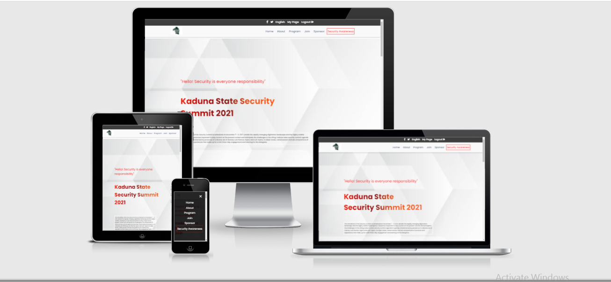

# Capstone

Capstone is a project build using HTML, CSS, Flexbox, and Javascript!

If you like what you see and have a project you need coded, don't hesitate to contact me.

# Responsiveness

# Built With

- Major languages: HTML and CSS
- Frameworks: N/A
- Technologies used: Web services

# Live Demo

[Live Demo Link](https://emmy-github-webdev.github.io/capstone-one).

# Video Presentation

[Video](https://www.loom.com/share/3ee39a5466dc43c9b73ce0a3cf75c549).

# Getting Started

To get a local copy up and running follow these simple example steps.

## Prerequisites 
- A working Laptop or Desktop
## Setup
- Install code editor
- Install Git bash
## Install
- clone the [https://github.com/Emmy-github-webdev/capstone-one).
## Usage
- Test your GitHub flow, a linter and professional documentation ability
## Run tests
- Open the project with code editor or double click the index.html file to run the project
## Deployment
- Push the project to your GitHub repo
- Navigate to page in the prject settings and publish
# Authors

- GitHub: [@githubhandle](https://github.com/Emmy-github-webdev).
- Twitter: [@twitterhandle](@ogaemmanueloga).
- LinkedIn: [Linkedin](https://github.com/Emmy-github-webdev/lint-test).

# Contributing

Contributions, issues, and feature requests are welcome!

Feel free to check the [issues page](https://github.com/Emmy-github-webdev/capstone-one/issues).

# Show your support

Give a :star: if you like this project!

# Acknowledgments

Hat tip to [Cindy Shin](https://www.behance.net/adagio07) the [author of the original design](https://www.behance.net/gallery/29845175/CC-Global-Summit-2015).

